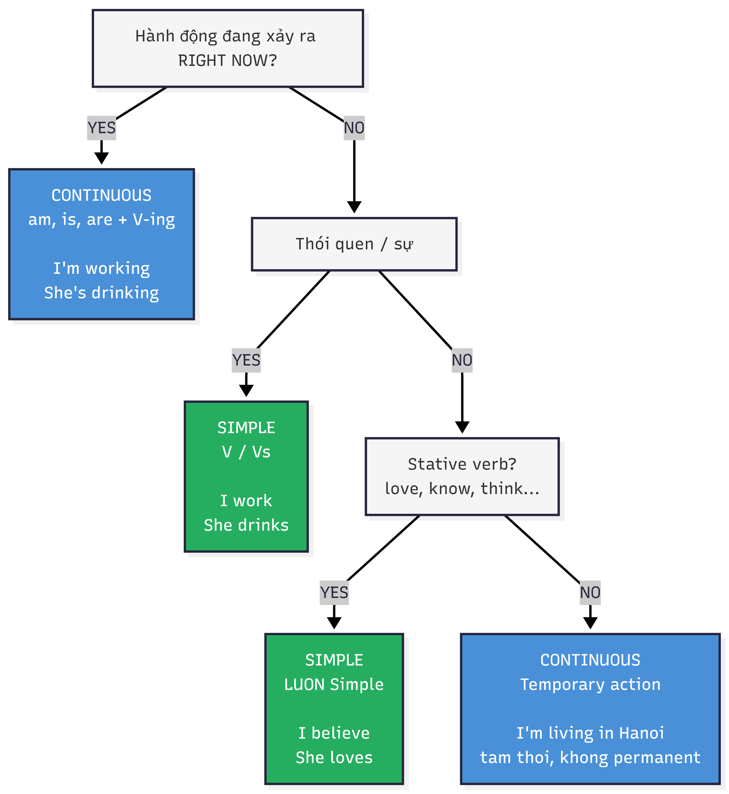
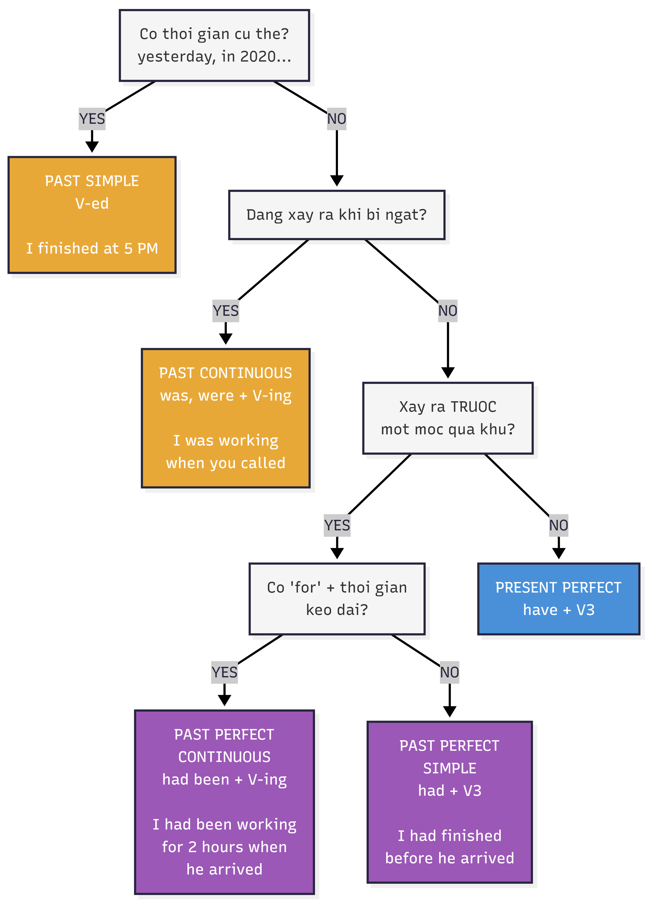

# Simple hay Continuous? — Sơ đồ quyết định

---

## 🟢 **FLOWCHART 1: PRESENT SIMPLE vs CONTINUOUS**

---

## 🟠 **FLOWCHART 2: PAST SIMPLE vs CONTINUOUS vs PERFECT**

---

## 📊 **Simple vs Continuous — Khi nào khác nhau?**

| **Dấu hiệu** | **→ Simple** | **→ Continuous** |
|---|---|---|
| **Đếm được kết quả** | 3 reports, twice, 5 hours completed | ❌ KHÔNG dùng |
| **Nhấn thời gian kéo dài** | ❌ KHÔNG dùng | for 3 hours, all day, since morning |
| **Stative verb** | ✅ LUÔN Simple (like, know, think) | ❌ KHÔNG BAO GIỜ dùng |
| **RIGHT NOW / đang xảy ra** | ❌ KHÔNG dùng | ✅ DÙNG (right now, at the moment) |
| **Hoàn thành, rõ điểm kết thúc** | ✅ DÙNG (finished, left, arrived) | ❌ KHÔNG dùng |
| **Thói quen / sự thật** | ✅ DÙNG (every day, usually, always) | ❌ KHÔNG dùng |

---

## ⚡ **Quick Tips**

✓ **Countable results** (số lượng) → **Simple**: "I have written **3 reports**"  
✓ **Duration ongoing** (khoảng thời gian) → **Continuous**: "I have been working **for 3 hours**"  
✓ **Stative verbs** (love, know, think) → **LUÔN Simple**: "I love coffee" ✗ "I am loving coffee"
